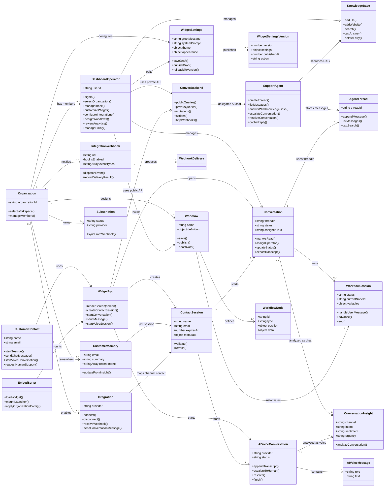
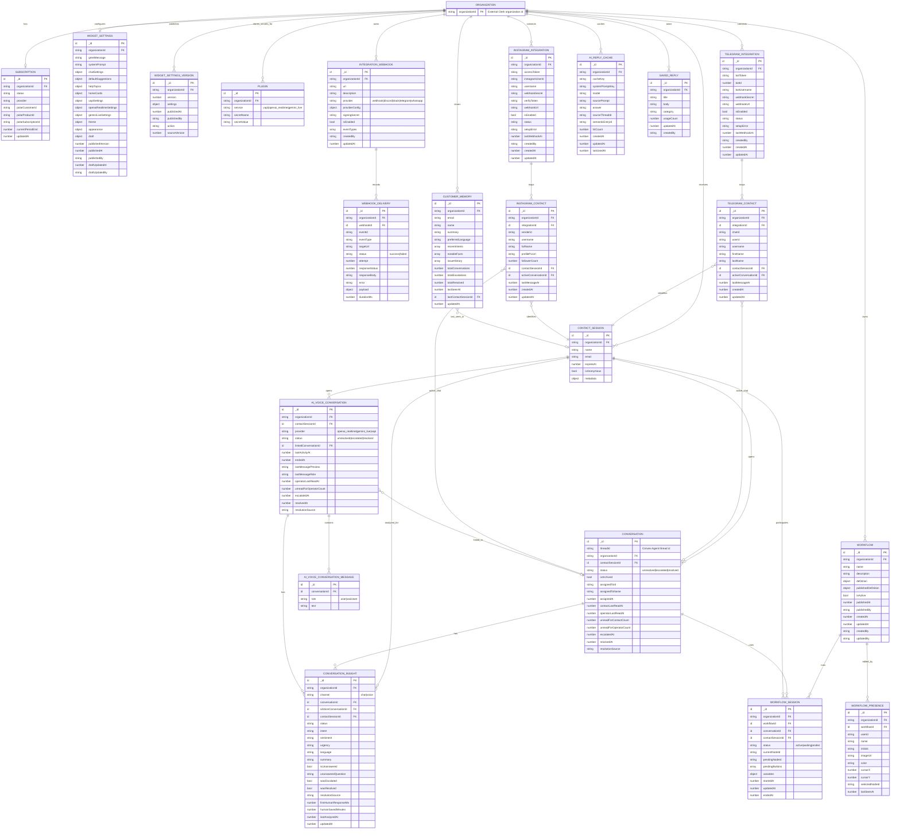

# Osonflow Application Diagrams

Generated from the current application structure:

- Frontend: `apps/web`, `apps/widget`, `apps/embed`
- Backend: `packages/backend/convex`
- Main data model source: `packages/backend/convex/schema.ts`

## Class Diagram

## Use Case Diagram

```mermaid
flowchart LR
  Operator[Dashboard operator]
  Customer[Customer contact]
  Clerk[Clerk auth]
  Polar[Polar billing]
  AI[AI providers<br/>OpenAI, Gemini, Vapi]
  Channels[Channel providers<br/>Telegram, Instagram]
  Webhooks[External webhook receivers]

  subgraph Platform[Osonflow support platform]
    UC1((Sign in and select organization))
    UC2((Manage team and account settings))
    UC3((Customize support widget))
    UC4((Publish widget settings))
    UC5((Upload files and website knowledge))
    UC6((Test knowledge base answers))
    UC7((Configure AI voice plugins))
    UC8((Connect Telegram or Instagram))
    UC9((Configure outbound webhooks))
    UC10((Build and publish workflows))
    UC11((Monitor live workflow presence))
    UC12((View chat inbox))
    UC13((Reply to customer))
    UC14((Assign or change conversation status))
    UC15((Use saved replies))
    UC16((Export conversation transcript))
    UC17((View AI voice conversations))
    UC18((Review analytics and insights))
    UC19((Review customer memory))
    UC20((Manage subscription and billing))

    UC21((Load embedded widget))
    UC22((Create contact session))
    UC23((Browse help center))
    UC24((Start chat conversation))
    UC25((Send customer message))
    UC26((Receive AI answer))
    UC27((Escalate to human support))
    UC28((Start voice conversation))
    UC29((Download chat history))

    UC30((Receive channel webhook))
    UC31((Dispatch integration event))
    UC32((Sync subscription status))
    UC33((Analyze conversation intelligence))
  end

  Operator --> UC1
  Operator --> UC2
  Operator --> UC3
  Operator --> UC4
  Operator --> UC5
  Operator --> UC6
  Operator --> UC7
  Operator --> UC8
  Operator --> UC9
  Operator --> UC10
  Operator --> UC11
  Operator --> UC12
  Operator --> UC13
  Operator --> UC14
  Operator --> UC15
  Operator --> UC16
  Operator --> UC17
  Operator --> UC18
  Operator --> UC19
  Operator --> UC20

  Customer --> UC21
  Customer --> UC22
  Customer --> UC23
  Customer --> UC24
  Customer --> UC25
  Customer --> UC27
  Customer --> UC28
  Customer --> UC29

  Clerk --> UC1
  Clerk --> UC2
  Polar --> UC20
  Polar --> UC32
  AI --> UC26
  AI --> UC28
  Channels --> UC30
  Channels --> UC8
  Webhooks --> UC31

  UC3 -. includes .-> UC4
  UC5 -. includes .-> UC6
  UC24 -. includes .-> UC22
  UC25 -. includes .-> UC26
  UC26 -. extends .-> UC27
  UC28 -. may create .-> UC17
  UC30 -. creates or updates .-> UC24
  UC12 -. includes .-> UC13
  UC13 -. uses .-> UC15
  UC14 -. triggers .-> UC31
  UC25 -. triggers .-> UC33
  UC28 -. triggers .-> UC33
```

## ER Diagram

## Business Process Diagram

```mermaid
flowchart TB
  Start((Start))
  End((End))

  subgraph Setup[Organization setup]
    S1[Operator signs in with Clerk]
    S2[Select or create organization]
    S3[Configure subscription and billing]
    S4[Customize widget branding, greetings, AI prompts, help center, and voice settings]
    S5[Upload files or website content to knowledge base]
    S6[Test knowledge base answer quality]
    S7[Connect AI, Telegram, Instagram, and webhook integrations]
    S8[Build and publish optional automation workflows]
    S9[Publish widget settings]
  end

  subgraph CustomerEntry[Customer entry]
    C1[Embedded launcher loads on customer site]
    C2{Customer chooses channel}
    C3[Open web chat]
    C4[Start AI voice session]
    C5[Send Telegram or Instagram message]
    C6[Create or validate contact session]
  end

  subgraph ConversationFlow[Conversation handling]
    H1[Create conversation or voice conversation record]
    H2[Store customer message or voice transcript]
    H3{Active workflow available?}
    H4[Run workflow step and update workflow session]
    H5[Search knowledge base and reply cache]
    H6[Generate AI response]
    H7[Send reply to customer channel]
    H8{Issue resolved by AI or workflow?}
    H9[Mark conversation resolved]
    H10[Escalate to human operator]
  end

  subgraph OperatorWork[Human support operations]
    O1[Operator views inbox or AI voice inbox]
    O2[Review contact panel, transcript, insights, and customer memory]
    O3[Assign conversation owner]
    O4[Use saved reply or write manual response]
    O5[Update status as unresolved, escalated, or resolved]
    O6[Export transcript when needed]
  end

  subgraph Intelligence[Analytics and follow-up]
    A1[Analyze intent, sentiment, urgency, resolution, and response time]
    A2[Create or update conversation insight]
    A3[Update customer memory]
    A4[Update analytics dashboard]
    A5[Dispatch configured webhook events]
    A6[Record webhook delivery result]
  end

  Start --> S1 --> S2 --> S3 --> S4 --> S5 --> S6 --> S7 --> S8 --> S9
  S9 --> C1
  C1 --> C2
  C2 -->|Web widget| C3
  C2 -->|Voice| C4
  C2 -->|External channel| C5
  C3 --> C6
  C4 --> C6
  C5 --> C6

  C6 --> H1 --> H2 --> H3
  H3 -->|Yes| H4 --> H8
  H3 -->|No| H5 --> H6 --> H7 --> H8
  H8 -->|Yes| H9
  H8 -->|No or requested| H10

  H10 --> O1 --> O2 --> O3 --> O4 --> O5
  O5 -->|Needs more information| H2
  O5 -->|Resolved| H9
  O5 --> O6

  H9 --> A1
  H10 --> A1
  O6 --> A1
  A1 --> A2 --> A3 --> A4 --> A5 --> A6 --> End
```

